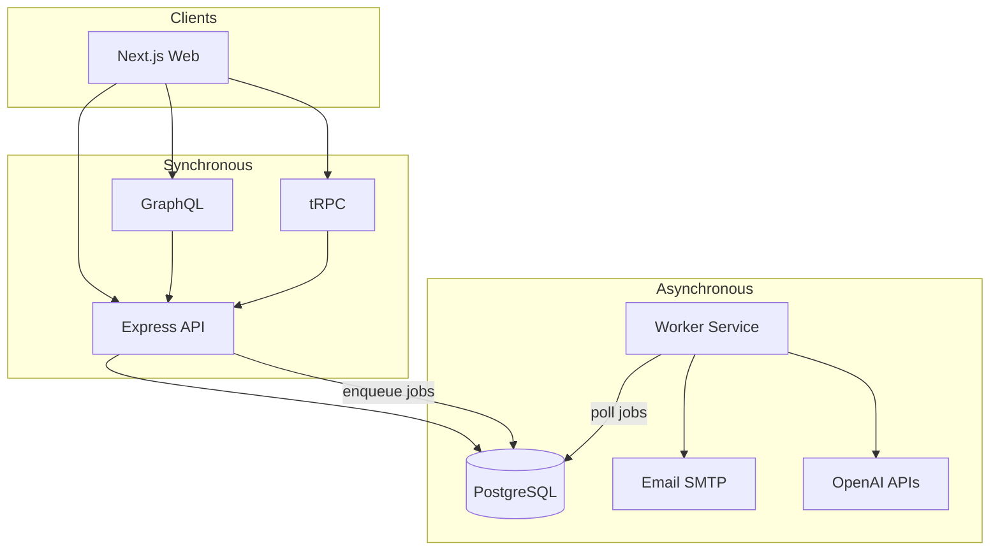

# 00 — Project Overview

## Concept: StrideMarket

**StrideMarket** is a niche marketplace limited to **running gear** (shoes, hydration, wearables, apparel, accessories). It mimics real classified/marketplace flows while staying small enough to learn from.

### Why a single niche?

- **Focused data model** — categories are sub-types of running gear, not an entire ecommerce catalog.
- **Clear AI prompts** — models get consistent domain context ("marathon", "hydration", "daily trainer").
- **Realistic but bounded** — you still learn search, moderation, sellers, and admin flows without scope explosion.

### UX inspiration

| Pattern | Source | Implementation |
|---------|--------|----------------|
| Visual listing grid | OLX / Mercado Livre | `ListingCard`, homepage sections |
| Hero + search | Marketplace homepages | AI search hero + keyword bar |
| Trust & conversion | Airbnb-style listing detail | Price prominence, seller block, CTA |
| Mobile-first | Modern ecommerce | MUI responsive grid, sticky header |

## Services (mental model)

## Learning outcomes

After working through this repo and docs:

1. **Design a modular monorepo** with shared packages and multiple deployable apps.
2. **Implement auth** with encrypted sessions, email verification, and RBAC.
3. **Expose APIs** via GraphQL (feeds) and tRPC (typed mutations/dashboards).
4. **Integrate AI** in sync (chat, assist) and async (embeddings, moderation) paths.
5. **Process background work** without blocking HTTP requests.
6. **Structure a marketplace schema** for listings, sellers, moderation, and engagement.

## Next step

Continue to [01-architecture.md](./01-architecture.md), then [02-getting-started.md](./02-getting-started.md).
