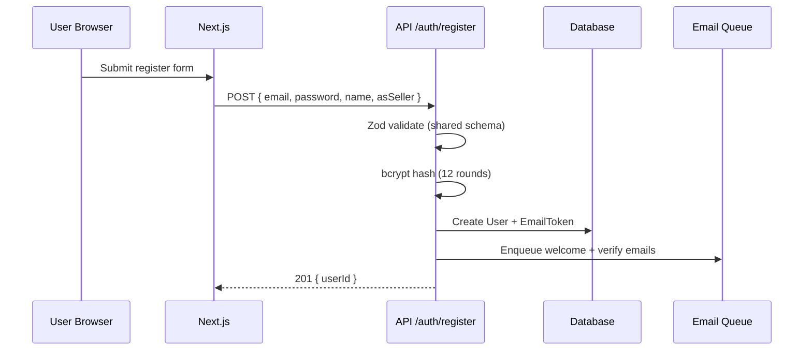

# 03 — Authentication & Security

## Design goals

1. **Browser sessions** via encrypted cookies (iron-session)
2. **Role-based access** (USER → SELLER → ADMIN)
3. **No email enumeration** on forgot-password
4. **Server-side validation** with shared Zod schemas
5. **Rate limiting** on auth routes

## Flow: Registration



**Code path:**

- Schema: `packages/shared/src/schemas/auth.ts`
- Service: `apps/api/src/services/auth.service.ts`
- Route: `apps/api/src/routes/auth.routes.ts`

### Seller vs user

`asSeller: true` creates `UserRole.SELLER` plus a `SellerProfile` in `PENDING` moderation state.

Existing buyers can enable seller tools from `/sell`. The page calls
`POST /auth/become-seller`, which promotes the current session to `SELLER` and
upserts the related `SellerProfile` without exposing admin role changes.

## Flow: Login

1. Validate credentials with `bcrypt.compare`
2. Write `userId`, `role`, `email` to iron-session
3. `session.save()` sets `stride_session` cookie

```typescript
// apps/api/src/routes/auth.routes.ts (simplified)
session.userId = user.userId;
session.role = user.role;
await session.save();
```

Frontend uses `credentials: "include"` on fetch and tRPC.

## Email verification

- Token stored as **SHA-256 hash** in `EmailToken` (plaintext only in email link)
- Single-use via `usedAt`
- On success: `emailVerifiedAt` set, `status` → `ACTIVE`

## Forgot / reset password

- Always returns `{ success: true }` even if email unknown
- Reset token expires in **1 hour**

## Authorization (RBAC)

```typescript
// packages/shared/src/roles.ts
hasMinimumRole("SELLER", "SELLER") // true
hasMinimumRole("USER", "SELLER")   // false
```

tRPC procedures:

- `publicProcedure` — no auth
- `protectedProcedure` — any logged-in user
- `roleProcedure("SELLER")` — seller or admin

## Admin accounts

**Never** expose `role: ADMIN` in register schema or UI.

Create admins via:

- `packages/database/prisma/seed.ts`
- Future CLI: `npm run admin:create`

## Security checklist (implemented / planned)

| Control | Status |
|---------|--------|
| Password hashing (bcrypt) | ✓ |
| HttpOnly session cookie | ✓ |
| Helmet headers | ✓ |
| CORS restricted origin | ✓ |
| Rate limiting | ✓ |
| Zod input validation | ✓ |
| Upload MIME + size limits | ✓ |
| CSRF (SameSite cookies) | ✓ partial |
| JWT for mobile | Schema ready |
| 2FA | Roadmap |

## Exercise

Add Next.js middleware that redirects `/admin` unless `GET /auth/me` returns `role: ADMIN`.
