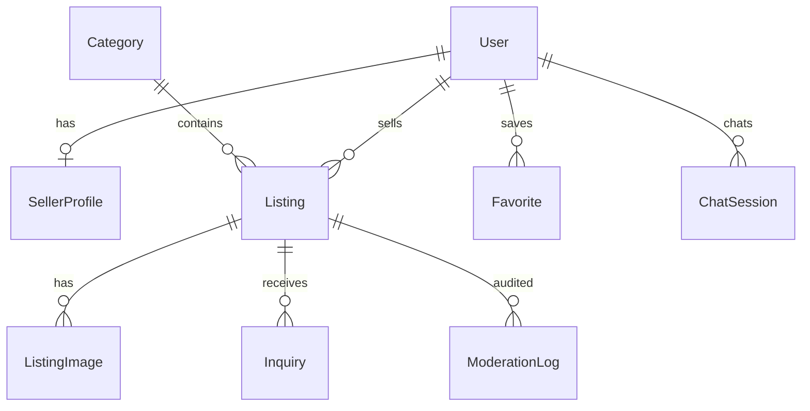

# 04 — Database Modeling

Schema file: `packages/database/prisma/schema.prisma`

## Entity relationship (simplified)



## Core tables

### User

Central identity. Roles: `USER`, `SELLER`, `ADMIN`. Status gates login (`SUSPENDED` blocked).

### SellerProfile

Separates **buyer identity** from **seller persona** (display name, verification, location). Onboarding can require admin approval before listings go live.

### Listing

Marketplace core:

| Field | Purpose |
|-------|---------|
| `priceCents` | Integer money — never float currency |
| `status` | Lifecycle: draft → pending → active → sold |
| `moderation` | AI + admin gate |
| `embedding` | `Float[]` for semantic search (upgrade to pgvector) |
| `trendingScore` | Denormalized rank — updated by worker |

### BackgroundJob / EmailOutbox

Transactional outbox pattern for async work — see [07-workers.md](./07-workers.md).

## Indexing strategy

```prisma
@@index([status, publishedAt])  // active feed queries
@@index([trendingScore])         // trending section
@@index([categoryId])            // category pages
```

## Migrations workflow

```bash
# After schema change
npm run db:migrate
# Name migration descriptively: add_listing_embeddings
```

## Seed data

`prisma/seed.ts` creates:

- 1 admin (not registrable via UI)
- 1 seller with active listing
- 1 buyer
- Categories for running niche
- Homepage banner

## Scalability evolution

1. **Read replicas** — route search queries to replica
2. **pgvector** — `embedding vector(1536)` + HNSW index
3. **Partitioning** — archive sold listings by month
4. **Event sourcing** — optional audit for moderation disputes

## Exercise

Add `ListingPriceHistory` to power AI pricing suggestions in seller dashboard.
