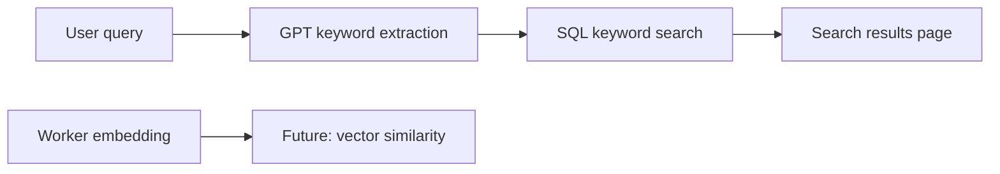

# 06 — AI Features (Educational)

StrideMarket demonstrates **five AI integration patterns** common in marketplaces.

## 1. AI Listing Assistant

**Goal:** Help sellers write better titles, descriptions, and tags.

| Step | Component |
|------|-----------|
| Seller clicks "AI listing assistant" | `apps/web/src/app/sell/page.tsx` |
| tRPC `ai.assistListing` | `apps/api/src/trpc/router.ts` |
| GPT-4o-mini JSON response | `apps/api/src/services/ai.service.ts` |

**Prompt design tip:** Ask for structured JSON (`response_format: json_object`) so you can map fields directly into React Hook Form via `setValue`.

Without `OPENAI_API_KEY`, API returns mock text — UI still works for learning.

## 2. AI Product Discovery

**Natural language search** on homepage hero:

```
"Show me lightweight running shoes for marathon beginners"
```

### Pipeline



1. **Sync:** GPT extracts `keywords` + optional `categoryHint`
2. **Search:** `listingService.search({ q: keywords.join(' ') })`
3. **Async:** Worker stores embeddings on listings for semantic upgrade

**Upgrade:** Compare query embedding to `Listing.embedding` with cosine similarity (pgvector).

## 3. AI Moderation

Triggered when seller submits listing:

```typescript
await enqueueJob(JOB_QUEUES.AI_MODERATION, { listingId });
```

Worker (`ai-moderation.processor.ts`):

1. Calls OpenAI **Moderation API** on title + description
2. Writes `ModerationLog` with score
3. Sets `listing.moderation` to `FLAGGED` or leaves `PENDING` for human admin

**Important:** AI does not auto-approve — admin remains accountable.

### Duplicate detection (exercise)

Compare new listing embedding to existing active listings; flag if cosine similarity > 0.92.

## 4. AI Chat Assistant

tRPC `ai.chat`:

- Persists `ChatSession` + `ChatMessage` rows
- System prompt anchors domain: running gear marketplace
- Can be extended with **tool calling** to run real searches

**Next step:** Add function tool `searchListings(query)` that calls `listingService.search`.

## 5. AI Insights Dashboard (seller)

Planned metrics (worker batch or on-demand):

| Insight | Data source |
|---------|---------------|
| Best posting times | `publishedAt` vs `viewCount` |
| Pricing suggestions | category median `priceCents` |
| Title tips | A/B compare CTR proxies |
| Engagement | views + favorites trend |

Implement in `apps/web/src/app/dashboard` + worker `trending.processor.ts` patterns.

## Cost & safety controls

- Use `gpt-4o-mini` for high-volume tasks
- Cache embeddings — don't re-embed unchanged listings
- Log moderation decisions in `ModerationLog`
- Rate-limit AI endpoints per user (extend `RATE_LIMITS`)

## Environment

```bash
OPENAI_API_KEY=sk-...
```

Restart **both** API and worker after setting.

## Learning exercise order

1. Get listing assistant working with real API key
2. Run seed listing through moderation worker — inspect `ModerationLog`
3. Add pgvector semantic search
4. Wire chatbot to real search tool
