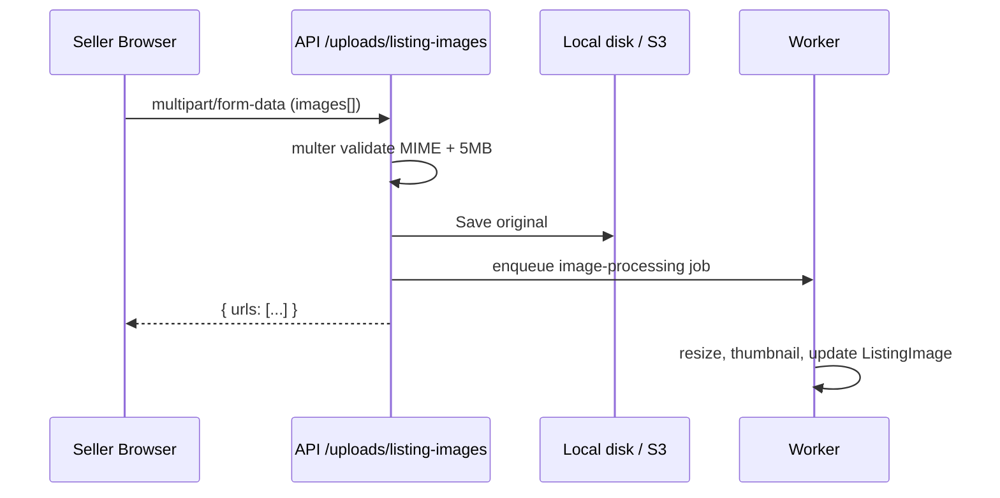

# 09 — Media Upload System

## Flow



Route: `apps/api/src/routes/upload.routes.ts`

## Validation layers

1. **Client** — file input `accept="image/*"` (UX only, not security)
2. **Multer** — MIME whitelist: jpeg, png, webp
3. **Size** — 5MB per file, max 8 files
4. **Future:** magic-byte check in worker

## Storage drivers

| Env | Driver | Path |
|-----|--------|------|
| Dev | `local` | `./uploads` |
| Prod | `s3` | Bucket + CDN URL in DB |

Listing stores **URLs only** — blobs never in PostgreSQL.

## Image processor (stub)

`apps/worker/src/processors/image.processor.ts`

Production checklist:

```typescript
// pseudocode
const buffer = await fs.readFile(path);
const optimized = await sharp(buffer).resize(1200).webp().toBuffer();
const thumb = await sharp(buffer).resize(300).webp().toBuffer();
await s3.upload({ Key: `listings/${id}/main.webp`, Body: optimized });
```

## Frontend (roadmap)

- Drag-and-drop zone with preview
- Lazy loading: `loading="lazy"` on `ListingCard`
- Next.js `<Image>` with remote patterns in `next.config.ts`

## Exercise

Wire `sharp` in worker and update `ListingImage.thumbnailUrl` after processing.
