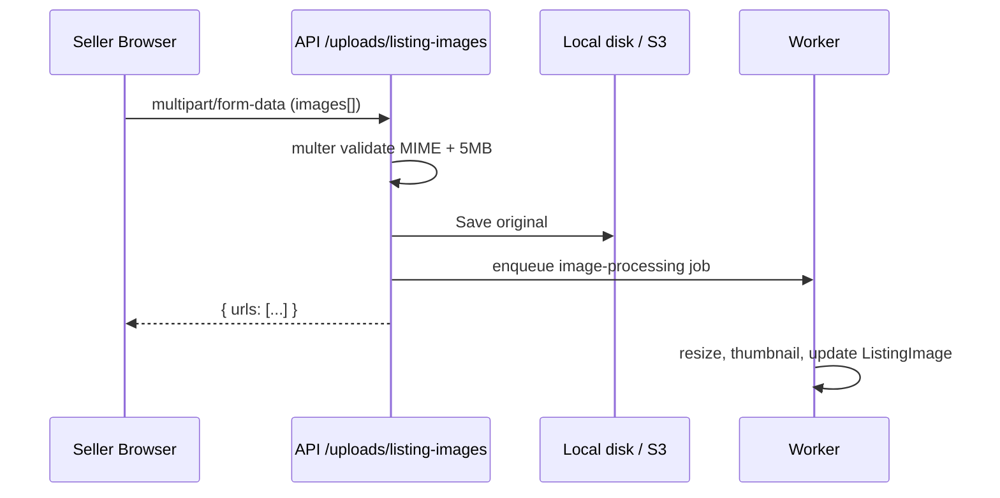

# 09 — Media Upload System

## Flow



Route: `apps/api/src/routes/upload.routes.ts`

Static serving: `apps/api/src/index.ts` mounts `express.static` on `/uploads`
after the upload router. The API also creates `STORAGE_LOCAL_PATH` on startup so
local uploads do not fail when the folder is missing.

Frontend URL handling: `apps/web/src/lib/media.ts` prefixes only `/uploads/...`
URLs with `NEXT_PUBLIC_API_URL`. Public web assets such as
`/placeholders/shoe-1.jpg` stay relative to the Next.js app.

## Validation layers

1. **Client** — file input `accept="image/*"` (UX only, not security)
2. **Multer** — MIME whitelist: jpeg, png, webp
3. **Size** — 5MB per file, max 8 files
4. **Future:** magic-byte check in worker

## Storage drivers

| Env | Driver | Path |
|-----|--------|------|
| Dev | `local` | `./uploads` |
| Prod | `s3` | Bucket + CDN URL in DB |

Listing stores **URLs only** — blobs never in PostgreSQL.

## Image processor (stub)

`apps/worker/src/processors/image.processor.ts`

Production checklist:

```typescript
// pseudocode
const buffer = await fs.readFile(path);
const optimized = await sharp(buffer).resize(1200).webp().toBuffer();
const thumb = await sharp(buffer).resize(300).webp().toBuffer();
await s3.upload({ Key: `listings/${id}/main.webp`, Body: optimized });
```

## Frontend (roadmap)

- Seller create/edit forms upload listing images and store returned URLs on `ListingImage`
- Lazy loading: `loading="lazy"` on `ListingCard`
- Next.js `<Image>` with remote patterns in `next.config.ts`

The seller edit form manages images by keeping the existing image URL list, removing URLs locally when the seller clicks remove, uploading any newly selected files through `/uploads/listing-images`, and then saving the final ordered URL list through `listings.updateMine`. The backend replaces the `ListingImage` rows for that listing inside the update.

## Exercise

Wire `sharp` in worker and update `ListingImage.thumbnailUrl` after processing.
