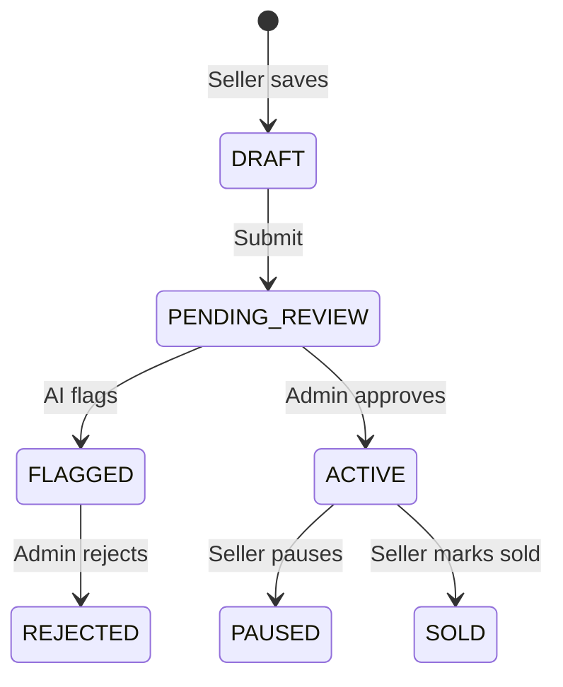

# 10 — Admin & Role-Based Access Control

## Role capabilities matrix

| Capability | USER | SELLER | ADMIN |
|------------|:----:|:------:|:-----:|
| Browse / search | ✓ | ✓ | ✓ |
| Favorites | ✓ | ✓ | ✓ |
| Contact seller | ✓ | ✓ | ✓ |
| Create listings | | ✓ | ✓ |
| Seller dashboard | | ✓ | ✓ |
| Approve listings | | | ✓ |
| Moderate users | | | ✓ |
| Manage banners | | | ✓ |
| Promote roles | | | ✓ |

## Admin creation policy

```
❌  POST /auth/register { role: ADMIN }
❌  Public admin signup page
✓  prisma/seed.ts
✓  Future: npm run admin:create --email ops@company.com
```

## Moderation workflow



Admin UI routes:

- `/admin` — overview counts and recent listings
- `/admin/listings` — moderation queue and all listings
- `/admin/users` — users, seller/admin promotion, suspension/reactivation
- `/admin/banners` — homepage banner creation, sort order, active toggle
- `/admin/reports` — report inbox with resolve/reopen
- `/admin/jobs` — background job monitor

The UI uses admin-only tRPC procedures from `apps/api/src/trpc/router.ts`.
Implementation details live in `apps/api/src/services/admin.service.ts`.

Moderation actions:

- Approve → `status: ACTIVE`, `moderation: APPROVED`, `publishedAt: now`, moderation log, email seller
- Reject → `status: REJECTED`, `moderation: REJECTED`, `moderationNote`, moderation log, email seller

## Promoting users

Admin-only tRPC procedure (exercise):

```typescript
admin.promoteUser: roleProcedure('ADMIN')
  .input(z.object({ userId: z.string(), role: z.enum(['SELLER', 'ADMIN']) }))
```

Never expose `ADMIN` promotion without audit log.

## Reports

`Report` model links users to listings with `resolved` flag — build admin inbox to review.

## Exercise

Add `AuditLog` table for admin actions (who approved which listing, when).
