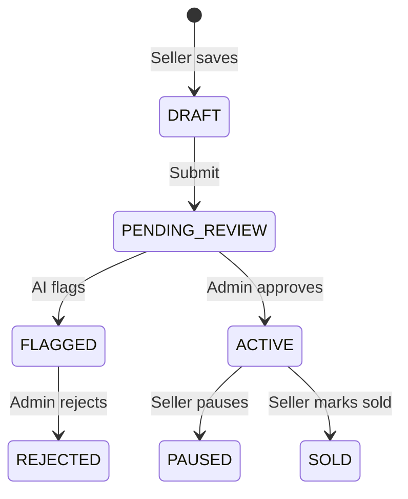

# 10 — Admin & Role-Based Access Control

## Role capabilities matrix

| Capability | USER | SELLER | ADMIN |
|------------|:----:|:------:|:-----:|
| Browse / search | ✓ | ✓ | ✓ |
| Favorites | ✓ | ✓ | ✓ |
| Contact seller | ✓ | ✓ | ✓ |
| Create listings | | ✓ | ✓ |
| Seller dashboard | | ✓ | ✓ |
| Approve listings | | | ✓ |
| Moderate users | | | ✓ |
| Manage banners | | | ✓ |
| Promote roles | | | ✓ |

## Admin creation policy

```
❌  POST /auth/register { role: ADMIN }
❌  Public admin signup page
✓  prisma/seed.ts
✓  Future: npm run admin:create --email ops@company.com
```

## Moderation workflow



Admin UI (`apps/web/src/app/admin/page.tsx`) is a scaffold — implement:

- Listing queue filtered by `moderation: PENDING | FLAGGED`
- Approve → `status: ACTIVE`, `publishedAt: now`, email seller
- Reject → `status: REJECTED`, `moderationNote`, email seller

## Promoting users

Admin-only tRPC procedure (exercise):

```typescript
admin.promoteUser: roleProcedure('ADMIN')
  .input(z.object({ userId: z.string(), role: z.enum(['SELLER', 'ADMIN']) }))
```

Never expose `ADMIN` promotion without audit log.

## Reports

`Report` model links users to listings with `resolved` flag — build admin inbox to review.

## Exercise

Add `AuditLog` table for admin actions (who approved which listing, when).
