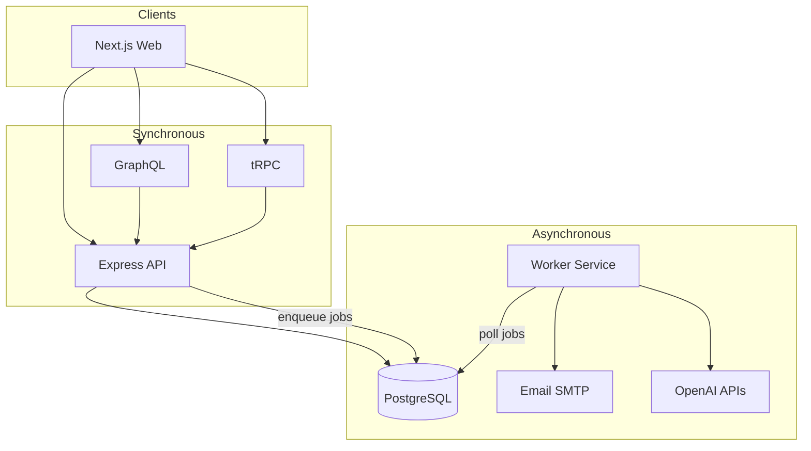
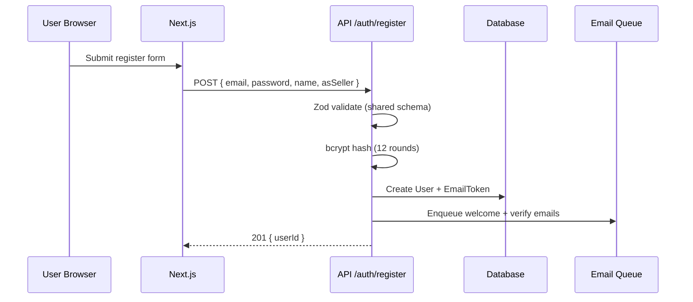
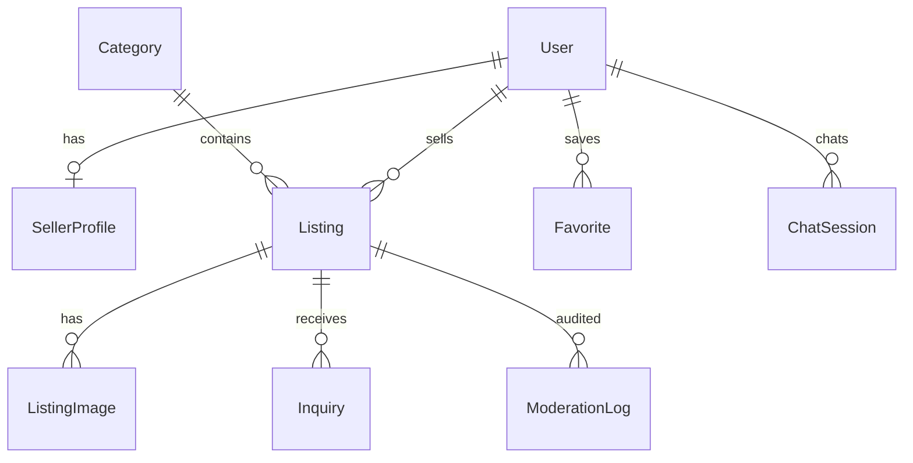
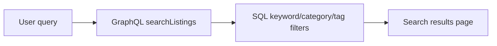
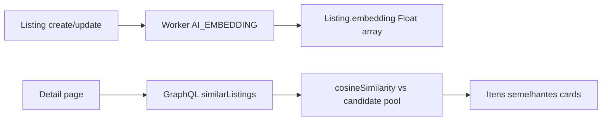
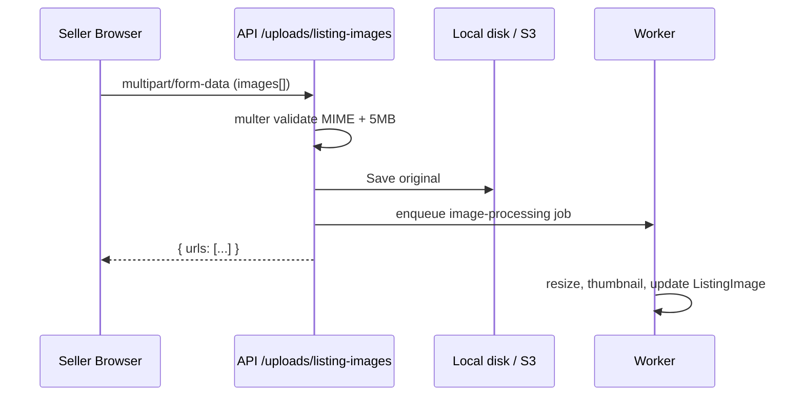
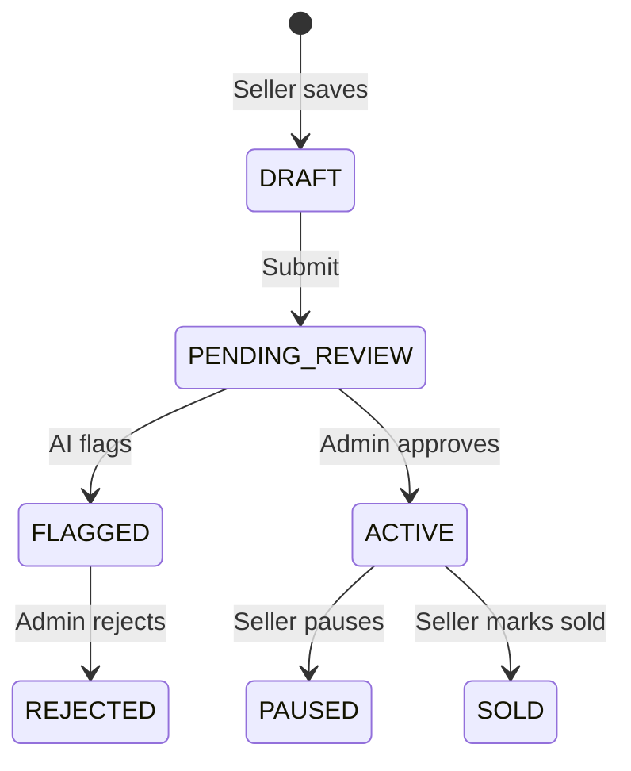

# ReRun Project Guide

This is the single documentation guide for the ReRun marketplace app. It replaces the previous numbered docs files and keeps the same project knowledge in one place.

## Contents

1. [Overview](#1-overview)
2. [Architecture](#2-architecture)
3. [Getting Started](#3-getting-started)
4. [Authentication](#4-authentication)
5. [Database](#5-database)
6. [GraphQL and tRPC](#6-graphql-and-trpc)
7. [AI Features](#7-ai-features)
8. [Workers](#8-workers)
9. [wlFrontend](#9-frontend)
10. [Media Uploads](#10-media-uploads)
11. [Admin and RBAC](#11-admin-and-rbac)
12. [Learning Roadmap](#12-learning-roadmap)

---

## 1. Overview

### Concept: ReRun

**ReRun** is a focused marketplace for selling unused items and reinvesting that value in what comes next. It mimics real classified/marketplace flows while staying small enough to learn from.

#### Why a single niche?

- **Focused data model** — categories stay intentionally bounded instead of becoming an entire ecommerce catalog.
- **Clear AI prompts** — models get consistent domain context ("marathon", "hydration", "daily trainer").
- **Realistic but bounded** — you still learn search, moderation, sellers, and admin flows without scope explosion.

#### UX inspiration


| Pattern             | Source                      | Implementation                      |
| ------------------- | --------------------------- | ----------------------------------- |
| Visual listing grid | OLX / Mercado Livre         | `ListingCard`, homepage sections    |
| Hero + search       | Marketplace homepages       | Standard search hero + keyword bar  |
| Trust & conversion  | Airbnb-style listing detail | Price prominence, seller block, CTA |
| Mobile-first        | Modern ecommerce            | MUI responsive grid, sticky header  |


### Services (mental model)




### Learning outcomes

After working through this repo and docs:

1. **Design a modular monorepo** with shared packages and multiple deployable apps.
2. **Implement auth** with encrypted sessions, email verification, and RBAC.
3. **Expose APIs** via GraphQL (feeds) and tRPC (typed mutations/dashboards).
4. **Integrate AI** in sync (chat, assist) and async (embeddings, moderation) paths.
5. **Process background work** without blocking HTTP requests.
6. **Structure a marketplace schema** for listings, sellers, moderation, and engagement.

### Next step

---

## 2. Architecture

### Clean separation of concerns


| Layer     | Location            | Responsibility                  |
| --------- | ------------------- | ------------------------------- |
| UI        | `apps/web`          | Rendering, forms, client state  |
| HTTP API  | `apps/api`          | Auth, validation, orchestration |
| Workers   | `apps/worker`       | Slow/async: email, AI, images   |
| Data      | `packages/database` | Prisma schema + client          |
| Contracts | `packages/shared`   | Zod schemas, constants, types   |


**Rule:** UI never talks to PostgreSQL directly. Workers never expose public HTTP except health checks.

### Why GraphQL *and* tRPC?

Both coexist intentionally (common in mature products):


| Use case                               | Protocol    | Reason                                        |
| -------------------------------------- | ----------- | --------------------------------------------- |
| Homepage, search, listing detail       | **GraphQL** | Flexible reads, Apollo cache, great for feeds |
| Seller dashboard, AI assist, favorites | **tRPC**    | End-to-end TypeScript types with Next.js      |


You could standardize on one — the dual setup teaches trade-offs.

### Authentication architecture

```
Browser → POST /auth/login → API validates bcrypt
         → iron-session cookie (httpOnly, signed)
         → Subsequent requests include cookie
         → GraphQL/tRPC context reads session
```

- **No admin signup** in frontend — `UserRole.ADMIN` only via seed/CLI.
- **Refresh tokens** modeled in DB for future mobile clients (`RefreshToken` table).
- See Authentication.

### Job queue (educational pattern)

Production systems often use **BullMQ + Redis**. This project uses a **database outbox** so you understand the pattern without extra infra:

1. API inserts `BackgroundJob` / `EmailOutbox`
2. Worker polls `PENDING` rows
3. Processor runs; status → `COMPLETED` or retry

Upgrade path documented in Workers.

### AI placement


| Feature                 | Sync (API)            | Async (Worker)      |
| ----------------------- | --------------------- | ------------------- |
| Listing assistant       | ✓ GPT chat completion | —                   |
| Similar listings        | ✓ cosine on embedding | ✓ build embeddings  |
| NL search keyword parse | ✓ (optional)          | Embedding optional  |
| Semantic embeddings     | —                     | ✓                   |
| Content moderation      | —                     | ✓ OpenAI moderation |
| Seller insights         | Future dashboard      | ✓ batch analytics   |


### Scalability notes

- **Stateless API** — scale horizontally behind a load balancer; session cookie must be sticky or use Redis session store.
- **Worker scaling** — run multiple worker instances with `FOR UPDATE SKIP LOCKED` job claiming (not implemented in v0 — exercise for you).
- **CDN** — serve images from S3 + CloudFront; API only stores URLs.
- **Search** — keep buyer search on keyword/category/tag filters; use `Listing.embedding` for similar listings (in-process cosine today, migrate to `pgvector` at scale).

### Folder conventions

```
apps/api/src/
  config/       # env validation (Zod)
  middleware/   # cross-cutting HTTP concerns
  routes/       # REST auth, uploads
  graphql/      # schema + resolvers
  trpc/         # procedures
  services/     # business logic (repository-style)
```

**Services** encapsulate Prisma calls — resolvers/procedures stay thin.

---

## 3. Getting Started

### Prerequisites

- **Node.js 20+**
- **Docker Desktop** (PostgreSQL, Redis, Mailpit)
- **OpenAI API key** (optional — AI features degrade gracefully to mocks)

### Step 1 — Environment

```bash
cp .env.example .env
```

Generate a session secret:

```bash
openssl rand -base64 32
```

Set in `.env`:

```
SESSION_SECRET="<your-generated-secret>"
```

Optional:

```
OPENAI_API_KEY="sk-..."
```

### Step 2 — Install dependencies

From repository root:

```bash
npm install
```

Workspaces install `apps/*` and `packages/*` together.

### Step 3 — Start infrastructure

```bash
docker compose up -d
```


| Container | Purpose                         | Port               |
| --------- | ------------------------------- | ------------------ |
| postgres  | Primary database                | 5432               |
| redis     | Reserved for future queue/cache | 6379               |
| mailpit   | Catches outbound email          | SMTP 1025, UI 8025 |


Verify:

```bash
docker compose ps
```

### Step 4 — Database setup

```bash
npm run db:generate   # Prisma client
npm run db:migrate    # Apply migrations
npm run db:seed       # Demo users + listings
```

Open Prisma Studio:

```bash
npm run db:studio
```

### Step 5 — Run applications

Use **three terminals**:

```bash
npm run dev:api      # :4000
npm run dev:worker     # :4001
npm run dev:web        # :3000
```

#### Health checks

```bash
curl http://localhost:4000/health
curl http://localhost:4001/health
```

#### GraphQL playground

Send POST to `http://localhost:4000/graphql`:

```graphql
query {
  categories { slug name }
  featuredListings(limit: 4) { title slug priceCents }
}
```

### Step 6 — Verify email flow

1. Register at [http://localhost:3000/register](http://localhost:3000/register)
2. Open Mailpit: [http://localhost:8025](http://localhost:8025)
3. Confirm verification email appears

### Troubleshooting


| Issue                      | Fix                                                   |
| -------------------------- | ----------------------------------------------------- |
| `SESSION_SECRET` too short | Must be 32+ characters for iron-session               |
| Prisma can't connect       | `docker compose up -d` and check `DATABASE_URL`       |
| Empty homepage             | Run `npm run db:seed`                                 |
| tRPC unauthorized on /sell | Login as `seller@stridemarket.local`                  |
| AI returns placeholders    | Set `OPENAI_API_KEY` in `.env` and restart API/worker |


### Next

Authentication

---

## 4. Authentication

### Design goals

1. **Browser sessions** via encrypted cookies (iron-session)
2. **Role-based access** (USER → SELLER → ADMIN)
3. **No email enumeration** on forgot-password
4. **Server-side validation** with shared Zod schemas
5. **Rate limiting** on auth routes

### Flow: Registration




**Code path:**

- Schema: `packages/shared/src/schemas/auth.ts`
- Service: `apps/api/src/services/auth.service.ts`
- Route: `apps/api/src/routes/auth.routes.ts`

#### Seller vs user

`asSeller: true` creates `UserRole.SELLER` plus a `SellerProfile` in `PENDING` moderation state.

Existing buyers can enable seller tools from `/sell`. The page calls
`POST /auth/become-seller`, which promotes the current session to `SELLER` and
upserts the related `SellerProfile` without exposing admin role changes.

### Flow: Login

1. Validate credentials with `bcrypt.compare`
2. Write `userId`, `role`, `email` to iron-session
3. `session.save()` sets `stride_session` cookie

```typescript
// apps/api/src/routes/auth.routes.ts (simplified)
session.userId = user.userId;
session.role = user.role;
await session.save();
```

Frontend uses `credentials: "include"` on fetch and tRPC.

### Email verification

- Token stored as **SHA-256 hash** in `EmailToken` (plaintext only in email link)
- Single-use via `usedAt`
- On success: `emailVerifiedAt` set, `status` → `ACTIVE`

### Forgot / reset password

- Always returns `{ success: true }` even if email unknown
- Reset token expires in **1 hour**

### Authorization (RBAC)

```typescript
// packages/shared/src/roles.ts
hasMinimumRole("SELLER", "SELLER") // true
hasMinimumRole("USER", "SELLER")   // false
```

tRPC procedures:

- `publicProcedure` — no auth
- `protectedProcedure` — any logged-in user
- `roleProcedure("SELLER")` — seller or admin

### Admin accounts

**Never** expose `role: ADMIN` in register schema or UI.

Create admins via:

- `packages/database/prisma/seed.ts`
- Future CLI: `npm run admin:create`

### Security checklist (implemented / planned)


| Control                   | Status       |
| ------------------------- | ------------ |
| Password hashing (bcrypt) | ✓            |
| HttpOnly session cookie   | ✓            |
| Helmet headers            | ✓            |
| CORS restricted origin    | ✓            |
| Rate limiting             | ✓            |
| Zod input validation      | ✓            |
| Upload MIME + size limits | ✓            |
| CSRF (SameSite cookies)   | ✓ partial    |
| JWT for mobile            | Schema ready |
| 2FA                       | Roadmap      |


### Exercise

Add Next.js middleware that redirects `/admin` unless `GET /auth/me` returns `role: ADMIN`.

---

## 5. Database

Schema file: `packages/database/prisma/schema.prisma`

### Entity relationship (simplified)




### Core tables

#### User

Central identity. Roles: `USER`, `SELLER`, `ADMIN`. Status gates login (`SUSPENDED` blocked).

#### SellerProfile

Separates **buyer identity** from **seller persona** (display name, verification, location). Onboarding can require admin approval before listings go live.

#### Listing

Marketplace core:


| Field           | Purpose                                             |
| --------------- | --------------------------------------------------- |
| `priceCents`    | Integer money — never float currency                |
| `status`        | Lifecycle: draft → pending → active → sold          |
| `moderation`    | AI + admin gate                                     |
| `embedding`     | `Float[]` cosine ranking for similar listings (pgvector later) |
| `trendingScore` | Denormalized rank — updated by worker               |


#### BackgroundJob / EmailOutbox

Transactional outbox pattern for async work — see Workers.

### Indexing strategy

```prisma
@@index([status, publishedAt])  // active feed queries
@@index([trendingScore])         // trending section
@@index([categoryId])            // category pages
```

### Migrations workflow

```bash
## After schema change
npm run db:migrate
## Name migration descriptively: add_listing_embeddings
```

### Seed data

`prisma/seed.ts` creates:

- 1 admin (not registrable via UI)
- 1 seller with several ACTIVE listings (shoes, hydration, wearable)
- Demo `embedding` vectors so similar listings work without OpenAI
- 1 buyer
- Categories for running niche
- Homepage banner

### Scalability evolution

1. **Read replicas** — route search queries to replica
2. **pgvector** — `embedding vector(1536)` + HNSW index
3. **Partitioning** — archive sold listings by month
4. **Event sourcing** — optional audit for moderation disputes

### Exercise

Add `ListingPriceHistory` to power AI pricing suggestions in seller dashboard.

---

## 6. GraphQL and tRPC

### GraphQL layer

- **Server:** `graphql-http` on Express (`/graphql`)
- **Schema:** `apps/api/src/graphql/typeDefs.ts`
- **Resolvers:** `apps/api/src/graphql/resolvers.ts`

#### When to use

- Homepage aggregated query (`HOMEPAGE_QUERY`)
- Listing search with filters
- Listing detail + similar listings (`LISTING_DETAIL_QUERY`)
- Public read-heavy endpoints

#### Example: homepage query

```graphql
query Homepage {
  categories { slug name }
  featuredListings(limit: 8) { title slug priceCents }
}
```

#### Example: similar listings

```graphql
query ListingDetail($slug: String!) {
  listing(slug: $slug) { title slug }
  similarListings(slug: $slug, limit: 4) { title slug priceCents }
}
```

Client: `apps/web/src/graphql/queries.ts` + Apollo (`apps/web/src/lib/apollo.ts`).

#### Context

Each request builds `ApiContext` with `prisma` + session — see `apps/api/src/context.ts`.

### tRPC layer

- **Router:** `apps/api/src/trpc/router.ts`
- **Client:** `apps/web/src/lib/trpc.ts`

#### When to use

- Mutations needing strict types (create listing, toggle favorite)
- AI procedures called from React hooks
- Seller/admin dashboards (future)

#### Example: create listing

```typescript
// Server
listings.create: roleProcedure("SELLER")
  .input(createListingSchema)
  .mutation(({ ctx, input }) =>
    listingService.create(ctx.session.userId, input)
  );
```

```typescript
// Client
const create = trpc.listings.create.useMutation();
await create.mutateAsync(formData);
```

#### Seller listing management

Authenticated seller workflows stay in tRPC:

- `listings.listMine` returns the signed-in seller's listings, including image, category, status, and moderation state.
- `listings.getMine` loads one seller-owned listing for editing.
- `listings.updateMine` updates supported listing fields and replaces the listing image URL set when `imageUrls` is provided.

Seller procedures use `roleProcedure("SELLER")`, so regular users must enable seller tools before using them. The service also checks listing ownership server-side; admins retain access through the existing role hierarchy. Edited listings are set back to `PENDING_REVIEW` with `PENDING` moderation and enqueue the existing moderation and embedding jobs.

#### superjson

Handles `Date`, `Map`, etc. between server and client — configured in `initTRPC` and tRPC client.

### Validation strategy

1. **Zod schemas** in `@stride/shared` (single source of truth)
2. **Parse at service boundary** — `createListingSchema.parse(raw)`
3. GraphQL args validated in service layer (not GraphQL-Scalars) for simplicity in v0

### Error handling

- REST: `AppError` → JSON `{ error, code }`
- tRPC: `TRPCError` with `UNAUTHORIZED` / `FORBIDDEN`
- GraphQL: throws bubble to graphql-http (add `formatError` in production)

### Exercise

Add GraphQL mutation `toggleFavorite` and compare ergonomics vs existing tRPC implementation.

---

## 7. AI Features

ReRun keeps buyer search conventional and reserves AI for flows where it has clearer product value.

### 1. AI Listing Assistant

**Goal:** Help sellers write better titles, descriptions, and tags.


| Step                                 | Component                             |
| ------------------------------------ | ------------------------------------- |
| Seller clicks "AI listing assistant" | `apps/web/src/app/sell/page.tsx`      |
| tRPC `ai.assistListing`              | `apps/api/src/trpc/router.ts`         |
| GPT-4o-mini JSON response            | `apps/api/src/services/ai.service.ts` |


**Prompt design tip:** Ask for structured JSON (`response_format: json_object`) so you can map fields directly into React Hook Form via `setValue`.

Without `OPENAI_API_KEY`, API returns mock text — UI still works for learning.

### 2. Buyer Search: Intentionally Non-AI

Buyer search uses the standard listing search endpoint:

```
/search?q=mochila%20quase%20nova
```

#### Pipeline



This avoids spending LLM budget on high-volume search when the AI layer does not materially improve results over the existing keyword/category/tag matching.

Embeddings are still valuable — they power **similar listings** on detail pages (below), not the search box.

### 3. Similar listings (“Itens semelhantes”)

**Goal:** Make stored `Listing.embedding` visible to buyers without putting an LLM in the search path.

#### Pipeline



1. **Async:** Worker (`ai-embedding.processor.ts`) embeds title + description + tags with `text-embedding-3-small` and stores the vector on the listing.
2. **Sync read:** `listingService.findSimilar(slug)` loads the source embedding, scores a bounded pool of ACTIVE/APPROVED candidates with cosine similarity (`apps/api/src/lib/vector.ts`), and returns the top matches.
3. **Fallback:** If embeddings are missing (no API key / job pending), return same-category listings by recency so the UI still works in local demo.
4. **UI:** Listing detail (`/listings/[slug]`) queries `similarListings` alongside `listing` and renders `ListingCard`s under **Itens semelhantes**.

Also available as tRPC `listings.similar` for typed clients.

**Upgrade:** Replace in-process scoring with `pgvector` / ANN indexes when the catalog grows.

### 4. AI Moderation

Triggered when seller submits listing:

```typescript
await enqueueJob(JOB_QUEUES.AI_MODERATION, { listingId });
```

Worker (`ai-moderation.processor.ts`):

1. Calls OpenAI **Moderation API** on title + description
2. Writes `ModerationLog` with score
3. Sets `listing.moderation` to `FLAGGED` or leaves `PENDING` for human admin

**Important:** AI does not auto-approve — admin remains accountable.

#### Duplicate detection (exercise)

Compare new listing embedding to existing active listings; flag if cosine similarity > 0.92.

### 5. AI Chat Assistant

tRPC `ai.chat`:

- Persists `ChatSession` + `ChatMessage` rows
- System prompt anchors domain: ReRun second-run marketplace
- Can be extended with **tool calling** to run real searches

**Next step:** Add function tool `searchListings(query)` that calls `listingService.search`.

### 6. AI Insights Dashboard (seller)

Planned metrics (worker batch or on-demand):


| Insight             | Data source                  |
| ------------------- | ---------------------------- |
| Best posting times  | `publishedAt` vs `viewCount` |
| Pricing suggestions | category median `priceCents` |
| Title tips          | A/B compare CTR proxies      |
| Engagement          | views + favorites trend      |


Implement in `apps/web/src/app/dashboard` + worker `trending.processor.ts` patterns.

### Cost & safety controls

- Use `gpt-4o-mini` for high-volume tasks
- Keep high-volume buyer search off LLM calls unless ranking quality clearly improves
- Prefer embeddings for similar listings (cheap read path) over LLM-in-search
- Cache embeddings — don't re-embed unchanged listings
- Log moderation decisions in `ModerationLog`
- Rate-limit AI endpoints per user (extend `RATE_LIMITS`)

### Environment

```bash
OPENAI_API_KEY=sk-...
```

Restart **both** API and worker after setting.

### Learning exercise order

1. Get listing assistant working with real API key
2. Run seed listing through moderation worker — inspect `ModerationLog`
3. Open a listing detail page — confirm **Itens semelhantes** ranks by embedding cosine
4. Wire chatbot to real search tool
5. Optional: evaluate vector ranking for search only if it beats keyword quality
---

## 8. Workers

### Why a worker service?

HTTP requests must stay fast. These operations are **slow or unreliable**:

- SMTP delivery
- Image resizing / S3 upload
- OpenAI API calls (moderation, embeddings)
- Trending score batch updates

Pattern: **Outbox + poller** (this repo) → evolve to **BullMQ + Redis**.

### Architecture

```
API handler
  → prisma.emailOutbox.create()
  → prisma.backgroundJob.create({ queue: 'email' })
  → return 201 to user immediately

Worker (every 3s)
  → fetch PENDING jobs
  → run processor
  → mark COMPLETED or retry
```

Entry: `apps/worker/src/index.ts`  
Poller: `apps/worker/src/poller.ts`

### Processors


| Queue constant     | File                         | Purpose                |
| ------------------ | ---------------------------- | ---------------------- |
| `email`            | `email.processor.ts`         | Send Mailpit/SMTP      |
| `image-processing` | `image.processor.ts`         | Thumbnails (stub)      |
| `ai-moderation`    | `ai-moderation.processor.ts` | OpenAI moderation      |
| `ai-embedding`     | `ai-embedding.processor.ts`  | text-embedding-3-small |
| `trending-recalc`  | `trending.processor.ts`      | Recompute scores       |


### Email flows


| EmailType            | Trigger                        |
| -------------------- | ------------------------------ |
| WELCOME              | Registration                   |
| VERIFY_EMAIL         | Registration                   |
| FORGOT_PASSWORD      | Forgot password form           |
| LISTING_APPROVED     | Admin approves (future)        |
| INQUIRY_NOTIFICATION | Buyer contacts seller (future) |


View dev emails: [http://localhost:8025](http://localhost:8025)

### Retry logic

```typescript
attempts >= maxAttempts → JobStatus.FAILED
else → back to PENDING
```

Production: exponential backoff + dead-letter queue.

### Upgrade to BullMQ

1. Keep `enqueueJob` interface
2. Replace Prisma insert with `queue.add(name, payload)`
3. Worker uses `Worker` class with concurrency
4. Keep `EmailOutbox` for audit trail

### Exercise

Implement `FOR UPDATE SKIP LOCKED` job claiming so two worker instances don't process the same job.

---

## 9. Frontend

### App Router structure

```
apps/web/src/app/
  page.tsx                 # Homepage (Server Component + GraphQL)
  search/page.tsx          # Search results (Client + Apollo)
  listings/[slug]/page.tsx # Detail (Server Component)
  category/[slug]/page.tsx
  (auth)/login|register/
  sell/page.tsx            # Seller form + AI assist (tRPC)
  seller/page.tsx          # Seller-owned listing overview
  seller/listings/[id]/edit/page.tsx # Seller listing edit form
  favorites/page.tsx
  admin/page.tsx           # Protected admin (wire middleware)
```

### Data fetching patterns


| Pattern                                | Used for                              |
| -------------------------------------- | ------------------------------------- |
| Server Component + `getApolloClient()` | SEO-friendly listing detail, homepage |
| Client `useQuery` (Apollo)             | Interactive search                    |
| Client `trpc.*.useMutation`            | Forms, AI, favorites                  |
| Client `trpc.*.useQuery`               | Authenticated seller/admin dashboards |


See `apps/web/src/lib/apollo-server.ts` for RSC integration.

### MUI theme

`apps/web/src/theme.ts` — marketplace-focused:

- **Primary green** — trust, sport, outdoors
- **Secondary orange** — CTA / conversion accents
- Rounded cards — modern classified aesthetic

### Forms

React Hook Form + Zod resolver + schemas from `@stride/shared`:

```typescript
useForm<LoginInput>({ resolver: zodResolver(loginSchema) });
```

Same schema validates on API — **no drift** between client and server.

### Key components


| Component      | Role                            |
| -------------- | ------------------------------- |
| `SiteHeader`   | Search bar, nav, sell CTA       |
| `ListingCard`  | Grid tile with price + location |
| `SearchHero`   | Homepage standard search entry  |


### Seller listing management

The `/seller` page lets signed-in sellers see only listings they own, with price, category, location, images, listing status, moderation state, and moderation note. Regular users see the existing seller-tools upgrade flow before they can manage listings.

The `/seller/listings/[id]/edit` page reuses the listing Zod schema, Material UI form controls, GraphQL categories query, and existing REST upload route. Sellers can update title, description, category, condition, price, city, state, tags, and images. Saving sends the listing back through the current moderation flow.

### Accessibility & SEO

- Semantic headings on listing detail
- `metadata` export in root layout
- Add `alt` on images when upload pipeline provides alt text (AI-generated optional)

### Exercise

1. Add `loading.tsx` skeletons for search grid
2. Implement `middleware.ts` for `/admin` and `/sell`
3. Add seller dashboard charts with MUI X Charts

---

## 10. Media Uploads

### Flow




Route: `apps/api/src/routes/upload.routes.ts`

Static serving: `apps/api/src/index.ts` mounts `express.static` on `/uploads`
after the upload router. The API also creates `STORAGE_LOCAL_PATH` on startup so
local uploads do not fail when the folder is missing.

Frontend URL handling: `apps/web/src/lib/media.ts` prefixes only `/uploads/...`
URLs with `NEXT_PUBLIC_API_URL`. Public web assets such as
`/placeholders/shoe-1.jpg` stay relative to the Next.js app.

### Validation layers

1. **Client** — file input `accept="image/*"` (UX only, not security)
2. **Multer** — MIME whitelist: jpeg, png, webp
3. **Size** — 5MB per file, max 8 files
4. **Future:** magic-byte check in worker

### Storage drivers


| Env  | Driver  | Path                   |
| ---- | ------- | ---------------------- |
| Dev  | `local` | `./uploads`            |
| Prod | `s3`    | Bucket + CDN URL in DB |


Listing stores **URLs only** — blobs never in PostgreSQL.

### Image processor (stub)

`apps/worker/src/processors/image.processor.ts`

Production checklist:

```typescript
// pseudocode
const buffer = await fs.readFile(path);
const optimized = await sharp(buffer).resize(1200).webp().toBuffer();
const thumb = await sharp(buffer).resize(300).webp().toBuffer();
await s3.upload({ Key: `listings/${id}/main.webp`, Body: optimized });
```

### Frontend (roadmap)

- Seller create/edit forms upload listing images and store returned URLs on `ListingImage`
- Lazy loading: `loading="lazy"` on `ListingCard`
- Next.js `<Image>` with remote patterns in `next.config.ts`

The seller edit form manages images by keeping the existing image URL list, removing URLs locally when the seller clicks remove, uploading any newly selected files through `/uploads/listing-images`, and then saving the final ordered URL list through `listings.updateMine`. The backend replaces the `ListingImage` rows for that listing inside the update.

### Exercise

Wire `sharp` in worker and update `ListingImage.thumbnailUrl` after processing.

---

## 11. Admin and RBAC

### Role capabilities matrix


| Capability       | USER | SELLER | ADMIN |
| ---------------- | ---- | ------ | ----- |
| Browse / search  | ✓    | ✓      | ✓     |
| Favorites        | ✓    | ✓      | ✓     |
| Contact seller   | ✓    | ✓      | ✓     |
| Create listings  |      | ✓      | ✓     |
| Seller dashboard |      | ✓      | ✓     |
| Approve listings |      |        | ✓     |
| Moderate users   |      |        | ✓     |
| Manage banners   |      |        | ✓     |
| Promote roles    |      |        | ✓     |


### Admin creation policy

```
❌  POST /auth/register { role: ADMIN }
❌  Public admin signup page
✓  prisma/seed.ts
✓  Future: npm run admin:create --email ops@company.com
```

### Moderation workflow




Admin UI routes:

- `/admin` — overview counts and recent listings
- `/admin/listings` — moderation queue and all listings
- `/admin/users` — users, seller/admin promotion, suspension/reactivation
- `/admin/banners` — homepage banner creation, sort order, active toggle
- `/admin/reports` — report inbox with resolve/reopen
- `/admin/jobs` — background job monitor

The UI uses admin-only tRPC procedures from `apps/api/src/trpc/router.ts`.
Implementation details live in `apps/api/src/services/admin.service.ts`.

Moderation actions:

- Approve → `status: ACTIVE`, `moderation: APPROVED`, `publishedAt: now`, moderation log, email seller
- Reject → `status: REJECTED`, `moderation: REJECTED`, `moderationNote`, moderation log, email seller

### Promoting users

Admin-only tRPC procedure (exercise):

```typescript
admin.promoteUser: roleProcedure('ADMIN')
  .input(z.object({ userId: z.string(), role: z.enum(['SELLER', 'ADMIN']) }))
```

Never expose `ADMIN` promotion without audit log.

### Reports

`Report` model links users to listings with `resolved` flag — build admin inbox to review.

### Exercise

Add `AuditLog` table for admin actions (who approved which listing, when).

---

## 12. Learning Roadmap

Follow this order to learn the **current AI + full-stack flow** end-to-end.

---

### Phase 1 — Foundation (Day 1–2)

#### Step 1: Read architecture

- Overview
- Architecture

**Outcome:** You can draw the web → API → DB → worker diagram from memory.

#### Step 2: Boot the stack

- Getting Started
- Run Docker, migrate, seed, all three apps

**Outcome:** Homepage shows featured listing from seed.

#### Step 3: Trace a GraphQL read

1. Open `apps/web/src/app/page.tsx`
2. Follow `HOMEPAGE_QUERY` → API resolver → `listingService.getFeatured`

**Outcome:** You understand Server Components + Apollo for reads.

---

### Phase 2 — Auth & RBAC (Day 3–4)

#### Step 4: Register and verify email

1. Register new user at `/register`
2. Check Mailpit
3. Trace `auth.service.ts` → `enqueueEmail`

Read Authentication

#### Step 5: Login and session

1. Login as seller seed account
2. Inspect `stride_session` cookie (httpOnly)
3. Call `GET /auth/me`

#### Step 6: RBAC

1. Try `/sell` logged out vs as seller
2. Read `roleProcedure` in `apps/api/src/trpc/trpc.ts`
3. Read Admin and RBAC

**Outcome:** You can explain why admin is seed-only.

---

### Phase 3 — Marketplace core (Day 5–7)

#### Step 7: Database model

- Study `schema.prisma` with Database
- Use Prisma Studio to explore relations

#### Step 8: Create a listing

1. Login as seller
2. Submit `/sell` form
3. Watch `BackgroundJob` rows appear in Studio

#### Step 9: Search & filters

1. Use `/search?q=nike`
2. Trace `listingService.search` filter builder

**Outcome:** You understand listing lifecycle and denormalized `trendingScore`.

---

### Phase 4 — Workers & email (Day 8–9)

#### Step 10: Worker poller

1. Run worker with logging
2. Create listing → see `ai-moderation` + `ai-embedding` jobs complete
3. Read Workers

#### Step 11: Email outbox

1. Register user → verify Mailpit received 2 emails
2. Trace `EmailOutbox` table status transitions

**Outcome:** You can articulate outbox vs synchronous SMTP.

---

### Phase 5 — AI integrations (Day 10–14)

#### Step 12: Listing assistant

1. Set `OPENAI_API_KEY`
2. Use AI button on `/sell`
3. Read AI Features §1

#### Step 13: Natural language search

1. Homepage AI hero query
2. Trace GPT keyword extraction → SQL search

#### Step 14: Moderation worker

1. Submit listing with edgy text (in dev)
2. Inspect `ModerationLog` in database

#### Step 15: Embeddings & similar listings

1. Confirm `listing.embedding` populated after the embedding job (or via seed demo vectors)
2. Open `/listings/[slug]` and inspect **Itens semelhantes**
3. Trace `similarListings` → `listingService.findSimilar` → cosine similarity
4. Plan pgvector upgrade when the catalog outgrows in-process scoring

#### Step 16: Chat assistant

1. Extend `ai.chat` with search tool (exercise)
2. Optional: embed widget on all pages

**Outcome:** You know when AI runs sync vs async and why.

---

### Phase 6 — Production thinking (Day 15+)

#### Step 17: Media pipeline

- Media Uploads
- Implement `sharp` + S3

#### Step 18: Admin panel

- Build approve/reject UI
- Listing approval emails

#### Step 19: Deploy

- Dockerize each app
- Managed PostgreSQL + Redis
- CDN for images
- Secrets via vault / platform env

#### Step 20: Observability

- Structured logging (pino)
- Error tracking (Sentry)
- AI cost dashboards

---

### Suggested capstone projects

1. **pgvector upgrade** for similar listings (and optional semantic search) at scale
2. **Seller analytics dashboard** with AI pricing tips
3. **Duplicate listing detector** using embeddings
4. **Mobile app** using JWT + same GraphQL API

---

### Documentation index


| #   | Doc              |
| --- | ---------------- |
| 00  | Overview         |
| 01  | Architecture     |
| 02  | Getting started  |
| 03  | Authentication   |
| 04  | Database         |
| 05  | GraphQL & tRPC   |
| 06  | AI features      |
| 07  | Workers          |
| 08  | Frontend         |
| 09  | Media uploads    |
| 10  | Admin & RBAC     |
| 11  | **This roadmap** |


Happy learning.
